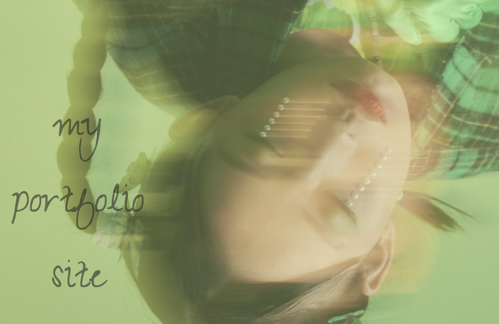

# 🎮 HASHIO PORTFOLIO

```text
╔════════════════════════════════════════════╗
║                                            ║
║          H A S H I O   P O R T F O L I O   ║
║                                            ║
║              >>> PRESS START <<<           ║
║                                            ║
╚════════════════════════════════════════════╝
```

> **Designing Experiences, Not Just Websites.**

デザイン・プログラミング・表現を組み合わせ、
**「伝わる体験」を作ること**をテーマに制作しているポートフォリオです。

🌐 **Live Site**


https://hashio251.github.io/

---

# 🌍 WORLD MAP

```text
▶ Home
▶ About
▶ Frontend
▶ Backend
▶ Gallery
▶ Contact
```

---

# 👤 PLAYER

|          |                                        |
| -------- | -------------------------------------- |
| Name     | Hashio                                 |
| Role     | Frontend Developer / Designer          |
| School   | Programming Student                    |
| Favorite | Pixel Art・Retro Design・Creative Coding |
| Motto    | Design the Experience                  |
| Goal     | Create websites people remember.       |

---

# 📖 STORY

このポートフォリオでは、個人制作のWebサイト・デザイン作品・フロントエンド制作物を掲載しています。

掲載作品の中には、学校で取り組んだテーマをもとに制作したものもあります。

しかし、**Webサイト自体は「授業で作るよう指示された成果物」ではありません。**

私は「伝え方も作品の一部」だと考えています。

例えばアートシンキングの授業では、多くの学生がPowerPointで発表する中、

**「見るだけではなく、実際に触れながら体験できる方が作品の魅力は伝わる」**

と考え、発表資料の代わりにWebサイトを制作しました。

スライドではなくデモサイトとして作品を見せたり、世界観を演出したり、情報をインタラクティブに伝えたりすることで、発表そのものを一つの作品として設計しています。

このポートフォリオは、

* 技術の学習記録
* デザイン制作
* アイデアの可視化
* 「伝え方」の研究

を継続してまとめていく場所でもあります。

---

# 🎯 MAIN QUEST

✔ アイデアをWebという形で表現する

✔ 「説明」を「体験」に変える

✔ デザインとプログラミングを組み合わせる

✔ 制作物と成長記録を残す

---

# 🕹 PROJECT SELECT

| Project               | Description                 |
| --------------------- | --------------------------- |
| 🎨 Portfolio          | このポートフォリオサイト                |
| 🧠 THIS IS ME PROJECT | アートシンキング発表サイト               |
| 🚀 FUTURE PROJECT     | 「10年後のZOZOTOWN」をテーマにした提案サイト |
| 💅 Nail Salon         | ネイルサロンWebサイト制作              |

## ▶ Play

### Portfolio

https://hashio251.github.io/

### THIS IS ME PROJECT

https://hashio251.github.io/THIS-IS-ME-PROJECT-art-thinking-/

### FUTURE PROJECT

https://hashio251.github.io/FUTURE-PROJECT-art-thinking-/

### Nail Salon

https://hashio251.github.io/01_website_nailsalon/

---

# ⚔ PLAYER STATUS

## Frontend

```text
HTML          ██████████
CSS           ██████████
JavaScript    █████████░
jQuery        ███████░░░
```

## Design

```text
Photoshop     ██████████
Illustrator   █████████░
Figma         ████████░░
```

## Currently Learning

```text
Java          █████░░░░░
PHP           ███░░░░░░░
Python        ███░░░░░░░
React         ███░░░░░░░
TypeScript    ██░░░░░░░░
```

---

# 🛠 EQUIPMENT

## Frontend

* HTML（テンプレート未使用・ゼロから実装）
* CSS（テンプレート未使用・ゼロから実装）
* JavaScript（テンプレート未使用・ゼロから実装）
* jQuery

## Design

* Photoshop

  * バナー制作
  * サムネイル制作
  * 画像編集
* Illustrator

  * Favicon制作
* Figma

  * UIデザイン
  * レイアウト設計
  * プロトタイプ制作

## Tools

* Git
* GitHub
* GitHub Pages
* Visual Studio Code

---

# 📂 WORLD DATA

```text
Portfolio
│
├── about/
├── frontend/
│   ├── website/
│   ├── javascript/
│   └── collection/
│
├── backend/
│   ├── java/
│   ├── php/
│   └── python/
│
├── gallery/
├── contact/
│
├── assets/
│   ├── css/
│   ├── js/
│   ├── images/
│   ├── icon/
│   ├── fonts/
│   └── slick/
│
├── index.html
└── README.md
```

---

# 🧩 DEVELOPMENT POLICY

このポートフォリオでは、「自分で考え、自分で作ること」を大切にしています。

## Original Works

* HTML・CSS・JavaScriptはテンプレートを使用せずゼロから実装
* UI・レイアウトはオリジナルで設計
* Photoshop・Illustratorで制作した素材を使用
* Figmaで画面設計・レイアウト検討
* 模写作品はオリジナル作品とは区別して掲載

## External Resources

### Slick Slider

カルーセル表示に利用しています。

### Hamburger Menu

公開されている実装例を参考にしています。

ただし、

* デザイン
* サイズ
* 配色
* アニメーション
* 表示・非表示の挙動
* サイト構造への組み込み

については、自サイト向けに調整・改変しています。

---

# 🎨 DESIGN CONCEPT

```text
Theme

Pixel
Retro
Minimal
Dark
```

## Keywords

* Pixel
* Retro
* Interactive
* Minimal
* Experience Design

## Fonts

* Zeyada
* Noto Sans JP

---

# 📚 QUEST LOG

このポートフォリオを制作する中で学んだこと。

### LEVEL UP

* HTMLによるページ設計
* CSSによるレイアウト・レスポンシブ対応
* JavaScriptによるインタラクション
* Git / GitHubによるバージョン管理
* GitHub Pagesによる公開
* Photoshop・Illustratorを利用した素材制作
* FigmaによるUI設計
* 「情報をどう伝えるか」を考えた設計・演出

---

# 🚀 NEXT UPDATE

```text
□ React作品追加
□ TypeScript作品追加
□ Java作品追加
□ PHP作品追加
□ Python作品追加
□ APIを利用したWebアプリ制作
□ Three.js作品追加
□ UI / UX改善
□ アニメーション追加
□ パフォーマンス改善
```

---

# 💡 PHILOSOPHY

```text
Webサイトを作ることが目的ではなく、

"伝わる体験をデザインすること"

を目的に制作しています。
```

---

# 💾 SAVE DATA

```text
Player : Hashio

Version : 2.0

Status : Still Developing...

Play Time : ∞
```

---

# 📜 LICENSE

このリポジトリはポートフォリオ作品として公開しています。

ソースコード・画像・デザイン等の著作権は制作者に帰属します。

ライブラリ等を除き、無断転載・再配布・商用利用はご遠慮ください。

---

```text
╔════════════════════════════════════════════╗
║                                            ║
║            SAVE COMPLETE.                  ║
║                                            ║
║      Thanks for visiting my world.         ║
║                                            ║
║          See you again :)                  ║
║                                            ║
╚════════════════════════════════════════════╝
```
